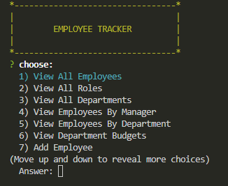

# employeeTracker

  

  ## Description
  This application is a employee tacker(CMS). Users able to view and manage the departments, roles, and employees.
  ## Web_Img
  

  ## Table of Contents
  * [Installation](#installation)
  * [Usage](#usage)
  * [License](#license)
  * [Contributing](#contributing)
  * [Tests](#tests)
  * [Questions](#questions)

  ## Installation 
  * Clone or download this repository. 
  * Install Node, MySql, and MySql workbench
  * Run schema.sql and seeds,sql to create database
  * Use command 'npm i' to install all the require file

  ## Usage 
  Use the command 'node index.js" to start the app. 
  [Video-Demo-link](https://drive.google.com/file/d/1agzLtmeZFLOvvkhK0sAixy5WVERlFIKA/view?usp=share_link)

  ## License 
  [GPLv3](https://choosealicense.com/licenses/gpl-3.0/)

  ## Contributing 
  N/A

  ## Tests
  N/A

  ## Questions
  Let me know if you need any help from me, you can contact me at jaspercheng2022@gmail.com. For more detail, please visit https://github.com/hpyorange or https://hpyorange.github.io/JasperWeb/.
